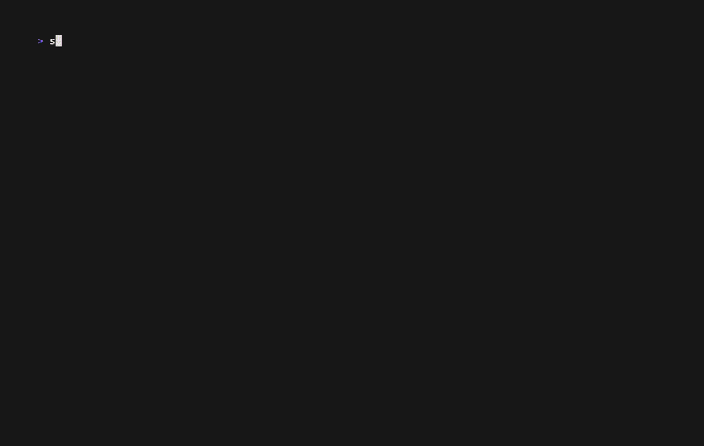

# stash

`stash` is a terminal UI for bookmarking, browsing, previewing, and resuming local Claude Code and Codex sessions.



It has three views:

- **Stash**: sessions you saved
- **History**: recent sessions
- **Active**: currently running Claude Code sessions

## Install

```sh
brew install jaredgizersky/tap/stash
```

Or build from source with Go:

```sh
go install github.com/jaredgizersky/stash/cmd/stash@latest
```

## Use

```sh
stash        # open the TUI
stash --all  # show sessions from all projects
stash list   # print saved/recent sessions
```

Claude Code and Codex history show up automatically from local session files.

## Agent hooks

Install the agent hook to type `stash` or `stash <name>` inside a session and have it save, name, and exit that session.

For Claude Code:

```sh
/plugin marketplace add jaredgizersky/stash
/plugin install stash@stash
/reload-plugins
```

For Codex:

```sh
codex plugin marketplace add jaredgizersky/stash
```

Codex also requires hooks and plugin-provided hooks to be enabled in
`~/.codex/config.toml`:

```toml
[features]
codex_hooks = true
codex_plugin_hooks = true
```

Restart Codex after changing the config.

## Keys

- `left` / `right`: switch tabs
- `j` / `k`: move
- `enter`: preview
- `r`: resume
- `S`: add to stash
- `d`: remove from stash
- `/`: filter
- `tab`: current project / all projects
- `n`: named only
- `q` / `esc`: quit or leave preview

## Config

By default, `stash` resumes sessions without bypassing tool permissions or sandboxing.

To resume Claude with `--dangerously-skip-permissions` and Codex with `--yolo`, create `~/.stash/config.toml`:

```toml
dangerously_skip_permissions = true
```

For one shell only:

```sh
export STASH_YOLO=1
```

## License

MIT
